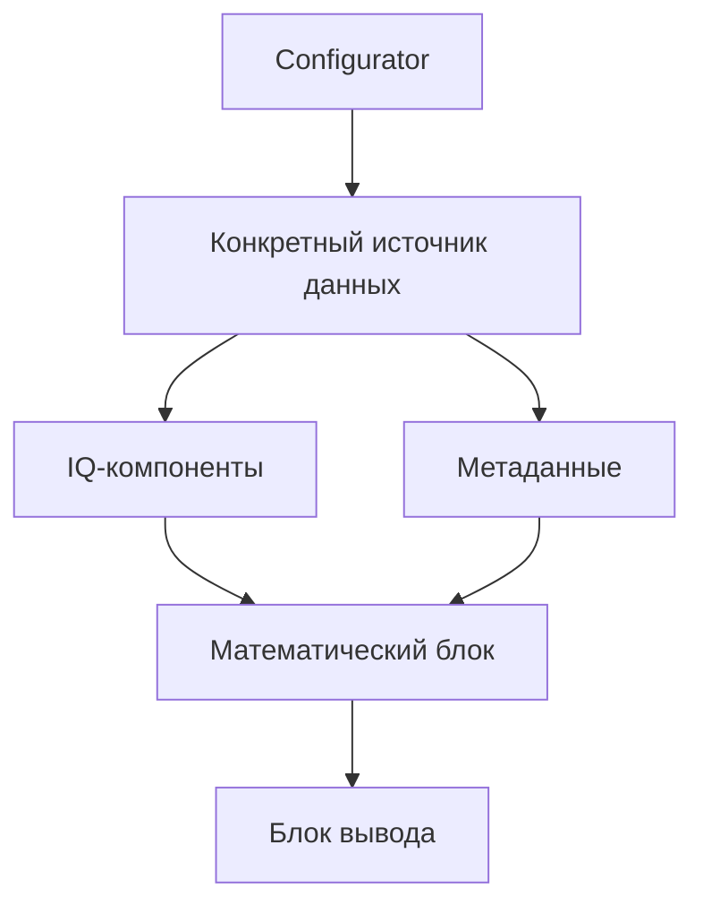

---
tags:
  - architecture
  - moc
  - hackrf
---

# Карта архитектуры

Эта папка - база знаний по переработке архитектуры проекта `hackrf-matlab-spectrum`.

Главная цель: постепенно превратить один крупный объект `RealtimeWasserfall` в набор небольших блоков с явными обязанностями.

## С чего начать чтение

1. [[01 - Архитектурная цель]]
2. [[02 - Пирамидальная декомпозиция]]
3. [[03 - Текущая архитектура источников данных]]
4. [[04 - Контракт источника данных]]
5. [[16 - История рефакторинга]]
6. [[17 - Архитектурные решения]]
7. [[13 - Следующие шаги]]

## Карта заметок

### Основные идеи

- [[01 - Архитектурная цель]]
- [[02 - Пирамидальная декомпозиция]]
- [[04 - Контракт источника данных]]
- [[14 - Глоссарий]]

### Реализованные классы

- [[05 - Configurator]]
- [[06 - FileDataSource]]
- [[07 - RecordedFileDataSource]]
- [[08 - RealtimeFileDataSource]]

### Работа с файлами

- [[09 - JSONL и файловый курсор]]
- [[10 - Жизненный цикл файлов]]
- [[11 - Формат IQ-данных]]

### Будущее развитие

- [[12 - Переход к сети]]
- [[13 - Следующие шаги]]
- [[15 - Полезные ссылки MATLAB]]

### Практика и проверка

- [[16 - История рефакторинга]]
- [[17 - Архитектурные решения]]
- [[18 - Сценарии использования]]
- [[19 - Проверка архитектуры]]
- [[20 - Старый и новый pipeline]]

### Исходники проекта

- [[21 - Исходники проекта]]

## Общая схема

## Исходный код

- [[22 - Source - Configurator|Configurator.m]]
- [[23 - Source - FileDataSource|FileDataSource.m]]
- [[24 - Source - RecordedFileDataSource|RecordedFileDataSource.m]]
- [[25 - Source - RealtimeFileDataSource|RealtimeFileDataSource.m]]
- [[26 - Source - waitForFile|waitForFile.m]]

## Статус

Заметки описывают состояние проекта на 2026-06-01.

Файловая ветка уже выделена в отдельные классы. Старый `pipeline.m` пока продолжает использовать `RealtimeWasserfall`, поэтому новая архитектура ещё не подключена к основному сценарию программы.
