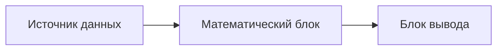

---
tags:
  - architecture
  - principles
---

# Архитектурная цель

## Проблема исходного решения

Первоначально класс `RealtimeWasserfall` отвечал сразу за несколько разных задач:

- ожидание файлов;
- чтение `metadata.jsonl`;
- чтение бинарных IQ-файлов;
- удаление файлов;
- хранение состояния;
- вычисление FFT;
- перевод мощности в децибелы;
- сжатие спектра;
- хранение матрицы водопада;
- создание и обновление графики.

Исходный код: [[28 - Source - RealtimeWasserfall|RealtimeWasserfall.m]].

Такой класс сложно расширять. Например, добавление сетевого источника данных вынуждало бы менять объект, который одновременно занимается математикой и отображением.

## Желаемый результат

Каждый блок должен выполнять маленькую задачу и не принимать решения за соседние блоки.

Источник отвечает только за получение очередной порции данных. Математический блок не знает, пришли данные из файлов или из сети. Блок вывода не знает, как вычислялся спектр.

## Проверочные вопросы

Для каждого класса полезно отвечать на четыре вопроса:

1. Какие данные он получает явно?
2. Какие данные он возвращает явно?
3. Какими ресурсами он владеет?
4. О чём он не должен знать?

## Пример хорошей границы

`FileDataSource` может знать:

- путь к директории;
- путь к `metadata.jsonl`;
- идентификатор открытого metadata-файла;
- формат бинарного IQ-файла.

`FileDataSource` не должен знать:

- размер FFT;
- тип оконной функции;
- количество строк водопада;
- параметры графики;
- устройство сетевого соединения.

## Связанные заметки

- [[02 - Пирамидальная декомпозиция]]
- [[03 - Текущая архитектура источников данных]]
- [[12 - Переход к сети]]
