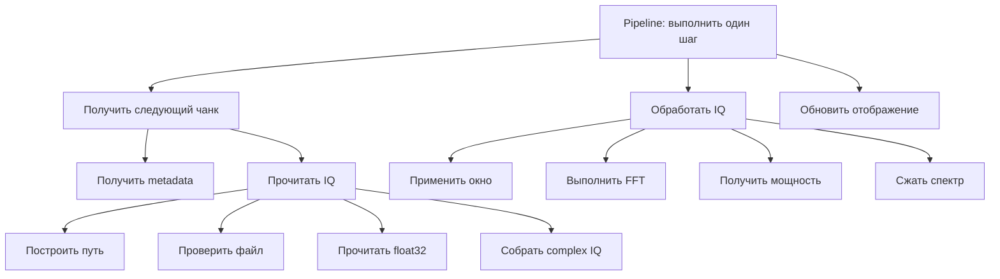

---
tags:
  - architecture
  - decomposition
---

# Пирамидальная декомпозиция

## Основная мысль

Комплексная задача строится из более маленьких задач. Верхний блок координирует нижние, но не выполняет их работу самостоятельно.



## Не каждый блок обязан быть классом

Полезное правило:

> Класс нужен там, где есть самостоятельная роль или состояние. Функция нужна там, где есть отдельное действие.

Примеры:

| Задача | Подходящая форма |
|---|---|
| Хранить открытый metadata-файл и выдавать чанки | класс |
| Ждать появления файла | функция |
| Декодировать `cf32_le` | функция или отдельный декодер |
| Выбрать источник по конфигу | конфигуратор или фабрика |

## Родительские классы

Родительский класс полезен, если несколько наследников разделяют общий механизм:

```text
FileDataSource
    общий readIQ()
    общий жизненный цикл metadata-файла

RecordedFileDataSource
    собственная политика обхода metadata

RealtimeFileDataSource
    собственная политика ожидания свежих данных
```

Если родитель не приносит общий код, свойства или полезный контракт, добавлять его заранее не нужно.

## Признаки неудачного разбиения

- В родителе появляются проверки вида `if realtime`.
- Один класс знает детали файлов, FFT и графики одновременно.
- Метод получает мало аргументов, но изменяет много скрытого состояния.
- Ради одного простого действия создаётся отдельный класс без состояния.
- Добавление сети требует менять математический блок.

## Связанные заметки

- [[01 - Архитектурная цель]]
- [[06 - FileDataSource]]
- [[12 - Переход к сети]]

