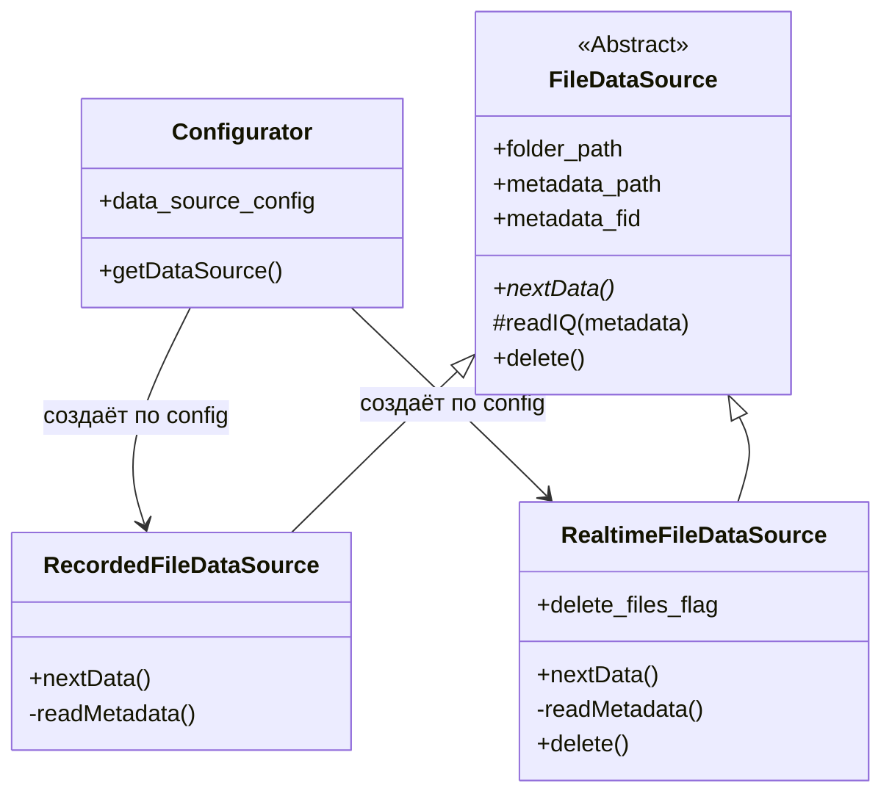

---
tags:
  - architecture
  - datasource
  - current-state
---

# Текущая архитектура источников данных

## Реализованная файловая ветка



## Почему два конкретных файловых источника

`RecordedFileDataSource` и `RealtimeFileDataSource` работают с одинаковыми файлами, но реализуют разные политики.

| Вопрос | Recorded | Realtime |
|---|---|---|
| Где начинается чтение JSONL? | С первой строки | Возле конца файла |
| Нужно ли сохранять порядок всех чанков? | Да | Не обязательно |
| Что означает отсутствие новой строки? | Запись закончилась | Нужно ждать |
| Можно ли удалять обработанные файлы? | Обычно нет | Возможно |
| Может ли JSONL расти во время чтения? | Обычно нет | Да |

Это не просто набор настроек. Семантика источников различается, поэтому отдельные классы оправданы.

## Внешний контракт

Оба источника предоставляют один метод:

```matlab
[iq_complex, metadata] = source.nextData();
```

Благодаря этому будущий pipeline сможет работать с выбранным источником одинаково.

## Текущие ограничения

- Новые классы уже подключены к [[27 - Source - pipeline|pipeline.m]], но обработка IQ и вывод ещё не перенесены в новые блоки.
- Очистка realtime-файлов пока требует доработки: массовое удаление `*.cf32` может создать гонку.
- Формирование текстов ошибок требует нормализации `char` и `string`.

Подробнее: [[13 - Следующие шаги]].
