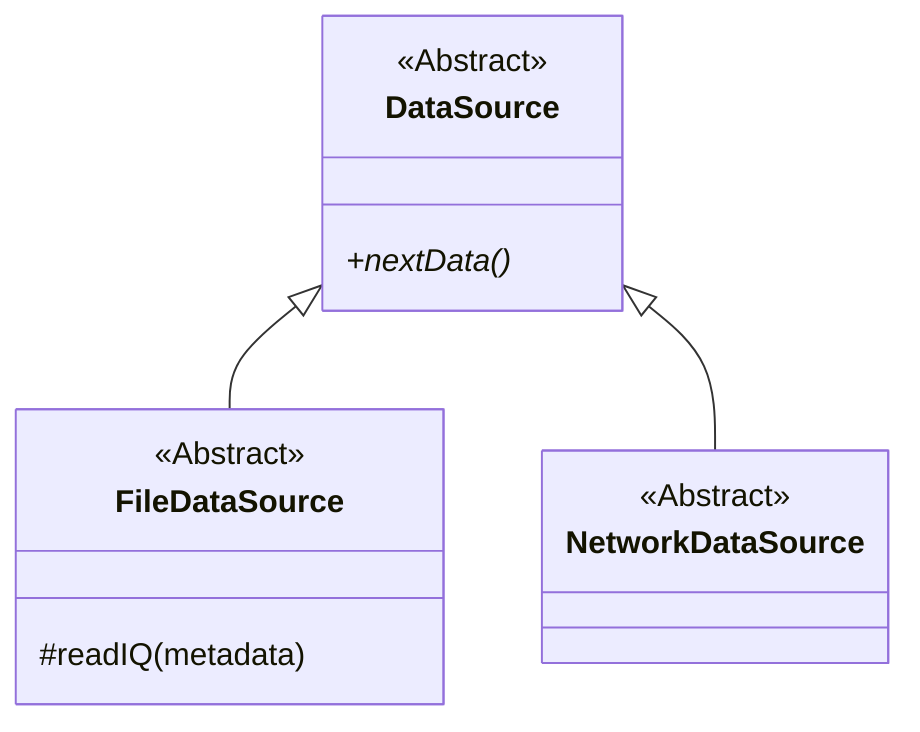

---
tags:
  - architecture
  - datasource
  - contract
---

# Контракт источника данных

## Что такое контракт

Контракт - это минимальный набор операций и смыслов, на которые может рассчитывать внешний код.

Для pipeline важно не устройство источника, а возможность получить следующую порцию данных:

```matlab
[iq_complex, metadata] = source.nextData();
```

## Почему контракт полезен

Pipeline не должен проверять:

```text
если источник файловый:
    читать JSONL
если источник сетевой:
    читать сокет
```

Вместо этого pipeline вызывает один метод:

```text
получить следующий чанк
```

Конкретный источник самостоятельно реализует нужный транспорт.

## Текущее состояние

Сейчас обязательный метод объявлен в абстрактном классе `FileDataSource`:

```matlab
methods(Abstract)
    [iq_complex, metadata] = nextData(obj);
end
```

Это означает:

- объект самого `FileDataSource` создать нельзя;
- любой конкретный файловый наследник обязан реализовать `nextData()`;
- неполный наследник обнаруживается во время создания объекта.

## Будущее развитие

При появлении сети контракт разумно поднять ещё на один уровень:



Тогда `FileDataSource` станет только файловой веткой, а `DataSource` будет описывать любой источник.

## Когда создавать общий DataSource

Не обязательно добавлять его заранее. Он понадобится, когда появится первая сетевая реализация или когда потребуется явно зафиксировать общий контракт источников.

## Связанные заметки

- [[03 - Текущая архитектура источников данных]]
- [[06 - FileDataSource]]
- [[12 - Переход к сети]]

