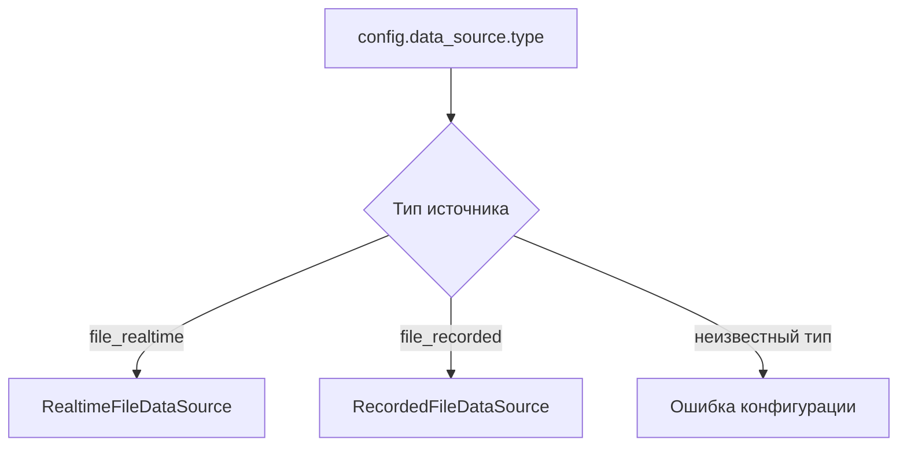

---
tags:
  - architecture
  - configurator
---

# Configurator

Исходный код: [[22 - Source - Configurator|Configurator.m]].

## Роль

`Configurator` создаёт нужный объект источника данных на основании конфига.

Он отвечает на вопрос:

> Какой конкретный блок нужно поставить в pipeline?

Он не отвечает на вопрос:

> Как читать JSONL, бинарный файл или сокет?

## Текущая конфигурация

```matlab
config.data_source.type
config.data_source.folder_path
config.data_source.delete_files_flag
```

Поддерживаются значения:

```text
file_realtime
file_recorded
```

## Схема выбора



## Почему выбор находится здесь

Выбор источника выполняется один раз при сборке приложения. После этого pipeline работает с готовым объектом и не спрашивает, какой у него тип.

Это удерживает условные конструкции `switch` и `if` на верхнем уровне программы.

## Правильная граница ответственности

`Configurator` может знать:

- допустимые типы источников;
- какие аргументы передать конструкторам;
- какой класс создать.

`Configurator` не должен знать:

- как устроен `metadata.jsonl`;
- как читать `cf32_le`;
- как вычислять FFT;
- как очищать пропущенные чанки;
- как обновлять водопад.

## Будущее

После добавления сети здесь может появиться новая ветка:

```text
network_tcp
network_udp
```

При этом математический блок меняться не должен.
