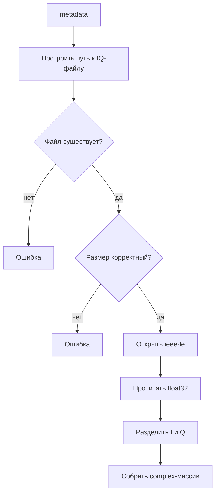

---
tags:
  - architecture
  - datasource
  - files
---

# FileDataSource

Исходный код: [[23 - Source - FileDataSource|FileDataSource.m]].

## Роль

`FileDataSource` - абстрактный родитель файловых источников.

Он описывает общее семейство:

> Источник получает данные из директории с `metadata.jsonl` и IQ-файлами.

Сам по себе он неполон: неизвестно, какую политику обхода metadata использовать.

## Что хранит класс

```text
folder_path
metadata_path
metadata_fid
```

## Что делает класс

- строит путь к `metadata.jsonl`;
- открывает metadata-файл;
- закрывает metadata-файл в деструкторе;
- предоставляет общий защищённый метод `readIQ(metadata)`;
- требует от наследников реализовать `nextData()`.

## Почему readIQ находится в родителе

Оба файловых наследника читают IQ одинаково:



Если общий алгоритм хранится в одном месте, исправления бинарного чтения применяются сразу ко всем файловым источникам.

## Почему readIQ protected

`readIQ()` нужен наследникам, но не должен быть частью публичного API приложения.

Уровни доступа:

| Access | Кто может вызвать |
|---|---|
| `public` | внешний код и наследники |
| `protected` | класс и наследники |
| `private` | только сам класс |

## Почему класс Abstract

Нельзя создать просто `FileDataSource`, потому что он не знает политику получения следующего чанка.

Абстрактный метод:

```matlab
[iq_complex, metadata] = nextData(obj);
```

обязывает наследников реализовать внешний контракт.

## Возможные улучшения

- Использовать `onCleanup` для гарантированного закрытия IQ-файла после `fopen`.
- Нормализовать `char` и `string` при формировании сообщений об ошибках.
- В будущем отделить декодирование `cf32_le` от файлового транспорта.

## Связанные заметки

- [[07 - RecordedFileDataSource]]
- [[08 - RealtimeFileDataSource]]
- [[11 - Формат IQ-данных]]
- [[15 - Полезные ссылки MATLAB]]
