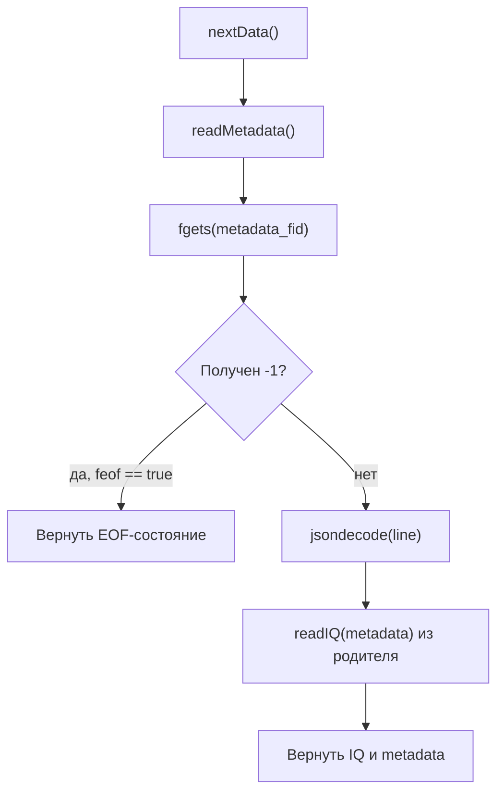

---
tags:
  - architecture
  - datasource
  - files
  - recorded
---

# RecordedFileDataSource

Исходный код: [[24 - Source - RecordedFileDataSource|RecordedFileDataSource.m]].

## Роль

`RecordedFileDataSource` последовательно воспроизводит сохранённую файловую запись.

Он должен выдать все чанки по порядку, начиная с первой строки `metadata.jsonl`.

## Алгоритм



## Почему курсор файла не нужно двигать вручную

После открытия файла курсор уже находится в начале.

Каждый успешный вызов `fgets`:

1. читает текущую строку;
2. возвращает её;
3. перемещает курсор к следующей строке.

Поэтому нельзя выполнять `fseek(..., "bof")` перед каждым чтением. Иначе источник будет бесконечно возвращать первую строку.

Подробнее: [[09 - JSONL и файловый курсор]].

## EOF

Для записанного источника EOF является нормальным состоянием:

```text
Запись закончилась.
```

Сейчас при EOF метод возвращает:

```matlab
iq_complex = -1;
metadata = [];
```

Позже можно рассмотреть более явный контракт:

```matlab
[iq_complex, metadata, has_data] = source.nextData();
```

Тогда EOF не придётся кодировать специальным значением `-1`.

## Что класс не должен делать

- ждать дописывания JSONL бесконечно;
- удалять IQ-файлы;
- перескакивать к последнему чанку;
- вычислять FFT;
- обновлять графику.
