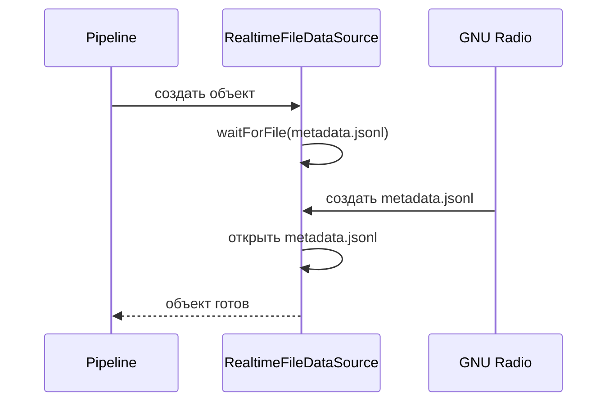
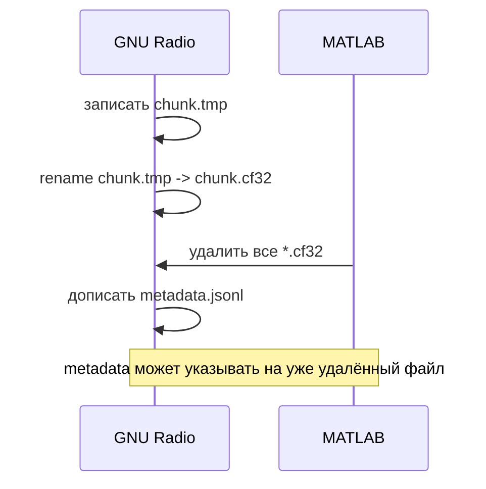

---
tags:
  - architecture
  - datasource
  - files
  - realtime
---

# RealtimeFileDataSource

Исходный код: [[25 - Source - RealtimeFileDataSource|RealtimeFileDataSource.m]].

## Роль

`RealtimeFileDataSource` получает свежие данные из файлов, которые создаёт GNU Radio во время работы.

Это потоковый источник. В отличие от [[07 - RecordedFileDataSource]], отсутствие новой строки metadata не означает завершение записи.

## Запуск

Перед вызовом родительского конструктора класс ждёт появления:

```text
metadata.jsonl
```

Для этого используется [[26 - Source - waitForFile|waitForFile.m]].



## Получение следующего чанка

Текущая политика:

1. перейти в конец `metadata.jsonl`;
2. дождаться полной новой строки;
3. декодировать JSON;
4. прочитать соответствующий IQ-файл через родительский `readIQ()`;
5. при включённой очистке удалить `.cf32`.

## Почему строка должна завершаться newline

GNU Radio дописывает JSONL во время работы. Если строка ещё не закончилась переводом строки, чтение могло попасть в середину записи.

Поэтому realtime-источник откатывает курсор и ждёт завершения строки.

## Важная открытая проблема: очистка

Сейчас используется массовое удаление:

```matlab
delete(fullfile(obj.folder_path, "*.cf32"));
```

Это рискованно.

GNU Radio сначала завершает IQ-файл, затем переименовывает его из `.tmp` в `.cf32`, и только после этого публикует строку metadata. Между этими действиями существует короткое окно:



Надёжная стратегия должна удалять только те файлы, которые явно признаны обработанными или пропущенными.

Подробнее: [[10 - Жизненный цикл файлов]] и [[13 - Следующие шаги]].

## Что класс не должен делать

- вычислять FFT;
- рисовать водопад;
- знать сетевой протокол;
- удалять файлы, судьбу которых он не определил явно.
