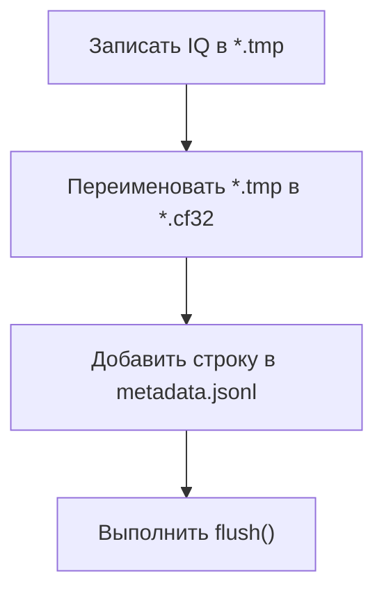

---
tags:
  - files
  - lifecycle
  - realtime
---

# Жизненный цикл файлов

## Какие файлы участвуют

GNU Radio создаёт:

```text
metadata.jsonl
chunk_000000000001.cf32
chunk_000000000002.cf32
...
```

Во время записи чанка временно существует файл:

```text
chunk_000000000003.cf32.tmp
```

## Публикация чанка со стороны GNU Radio

В [[29 - Source - chunked_iq_sink|chunked_iq_sink.py]] используется последовательность:



Идея хорошая: MATLAB не должен увидеть незавершённый IQ-файл через metadata.

## Владение ресурсами

Класс, открывший ресурс, должен его закрыть.

| Ресурс | Кто открывает | Кто закрывает |
|---|---|---|
| `metadata.jsonl` | `FileDataSource` | `FileDataSource.delete()` |
| один IQ-файл | `FileDataSource.readIQ()` | `FileDataSource.readIQ()` |

## Проблема массовой очистки

Удаление всех `.cf32` по маске удобно:

```matlab
delete(fullfile(folder_path, "*.cf32"));
```

MATLAB действительно поддерживает wildcard `*` в имени файла. Но в realtime-потоке этот подход слишком широкий.

Он может удалить:

- обработанный файл;
- пропущенный старый файл;
- только что опубликованный файл, metadata которого ещё не успела появиться.

## Более надёжная модель очистки

Источник должен удалять только конкретные файлы, судьба которых ему известна:

```text
обработанный чанк
пропущенный чанк, обнаруженный по metadata
```

Не стоит удалять файл только потому, что он имеет расширение `.cf32`.

## Отдельная команда purge

Массовое удаление по расширению уместно в отдельной явной операции очистки:

```text
purge()
```

Пользователь запускает её осознанно, когда хочет удалить накопленные данные.

## Ссылки

- [delete: удаление файлов и wildcard](https://www.mathworks.com/help/matlab/ref/delete.html)
- [[08 - RealtimeFileDataSource]]
- [[13 - Следующие шаги]]
