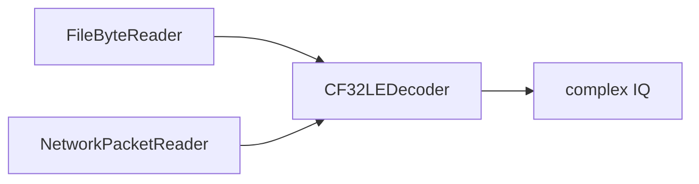

---
tags:
  - iq
  - binary
  - format
---

# Формат IQ-данных

## Формат файла

GNU Radio сохраняет IQ-данные в формате:

```text
cf32_le
```

Расшифровка:

| Часть | Смысл |
|---|---|
| `c` | complex |
| `f32` | компоненты представлены `float32` |
| `le` | little-endian порядок байтов |

Один IQ-sample занимает:

```text
4 байта I + 4 байта Q = 8 байт
```

## Последовательность значений

В бинарном файле числа лежат так:

```text
I1 Q1 I2 Q2 I3 Q3 ...
```

После чтения MATLAB разделяет нечётные и чётные позиции:

```text
raw_i = raw_iq(1, 3, 5, ...)
raw_q = raw_iq(2, 4, 6, ...)
```

и собирает:

```text
iq_complex = complex(raw_i, raw_q)
```

## Проверка размера

Ожидаемый размер файла:

```text
8 * metadata.samples_count
```

Если размер отличается, файл считается некорректным.

## Архитектурное развитие

Сейчас декодирование находится внутри `FileDataSource.readIQ()`.

При переходе к сети может оказаться полезным разделение:



Транспорт меняется, но декодер формата остаётся общим.

Не обязательно выделять декодер заранее. Делать это стоит, когда появится второй потребитель формата.

## Связанные заметки

- [[06 - FileDataSource]]
- [[12 - Переход к сети]]

