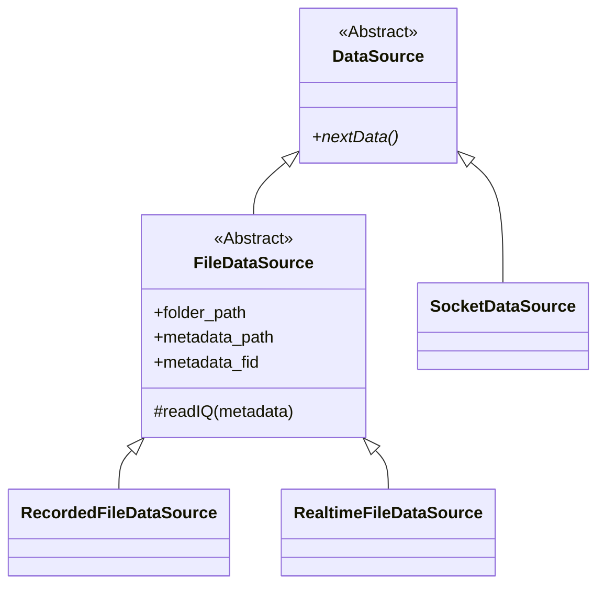
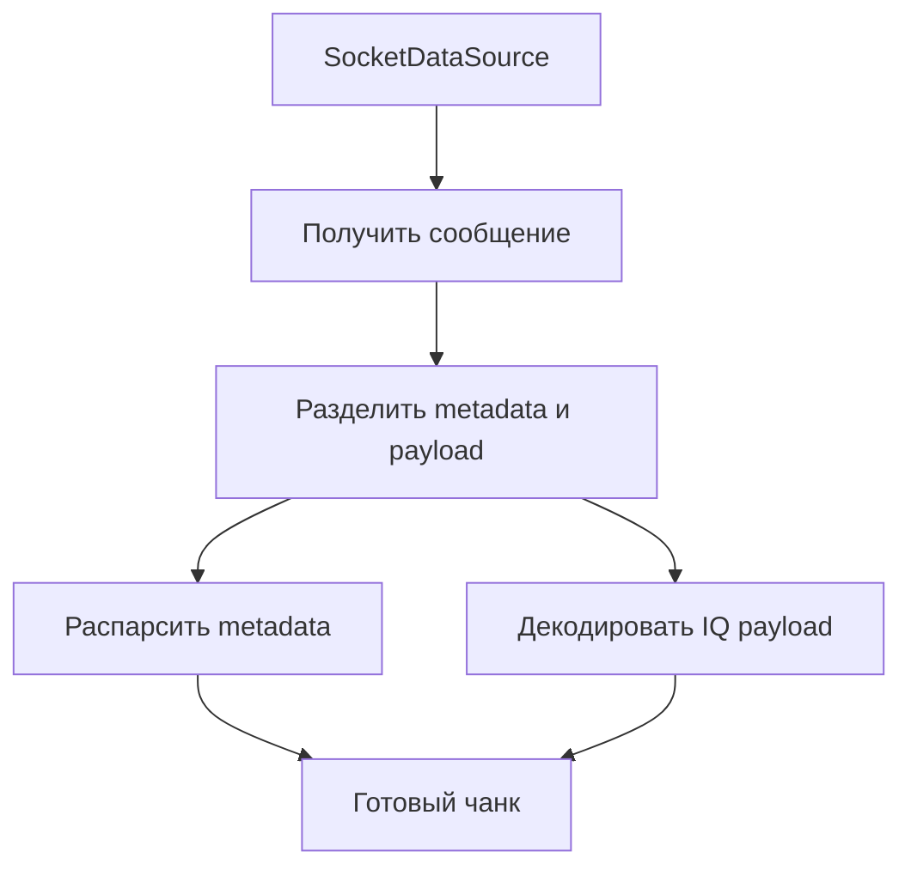

---
tags:
  - architecture
  - network
  - future
---

# Переход к сети

## Цель

Заменить или дополнить файловый транспорт сетевым соединением так, чтобы математический блок и блок вывода не пришлось переписывать.

## Будущая вершина иерархии

Когда появится сеть, можно добавить общий абстрактный класс:



## Почему DataSource пока не обязателен

Текущая файловая ветка уже работает без общего сетевого родителя.

Добавлять `DataSource` имеет смысл, когда:

- появится первая сетевая реализация;
- нужно будет формально закрепить общий контракт;
- несколько подсистем начнут работать с любыми источниками одинаково.

## Возможное устройство сетевого источника



## Важная граница

Сеть не должна проникать в математику:

```text
FileDataSource    -> IQ + metadata
SocketDataSource  -> IQ + metadata

MathBlock         -> принимает IQ + metadata
```

## Вопросы для будущего проектирования

1. Какой транспорт нужен: TCP, UDP или другой?
2. Должны ли metadata и IQ передаваться одним сообщением?
3. Как определить границу сообщения?
4. Нужны ли номера чанков для обнаружения потерь?
5. Как вести себя при разрыве соединения?
6. Нужен ли общий `CF32LEDecoder` для файлов и сети?

## Связанные заметки

- [[04 - Контракт источника данных]]
- [[11 - Формат IQ-данных]]
- [[13 - Следующие шаги]]

