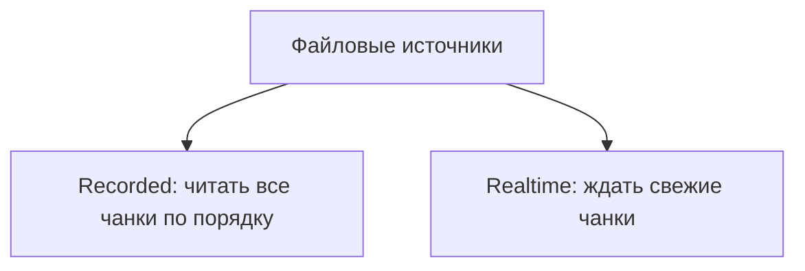
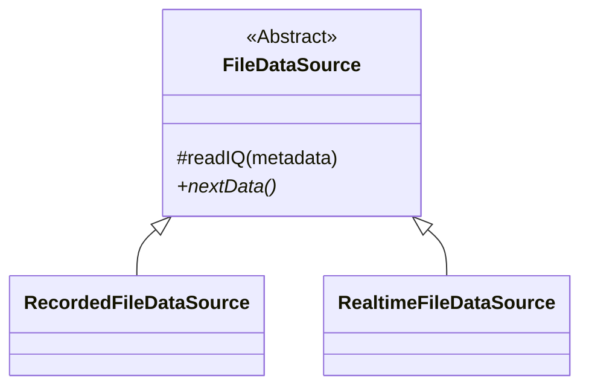

---
tags:
  - architecture
  - refactoring
  - history
---

# История рефакторинга

## Зачем понадобился рефакторинг

Исходный класс `RealtimeWasserfall` одновременно получал данные, обрабатывал их и рисовал результат.

Это позволяло быстро запустить первую версию программы, но создавало трудности:

- добавление сетевого источника затрагивало бы класс визуализации;
- тестирование файлового чтения требовало бы создавать объект водопада;
- правила работы с записанными и свежими данными смешивались бы;
- изменения в одном месте могли случайно повлиять на несвязанную часть программы.

Подробнее: [[01 - Архитектурная цель]].

## Шаг 1. Выделение источника данных

Первой новой идеей стал отдельный источник данных:

```text
Источник данных -> IQ + metadata
```

Источник скрывает детали транспорта. Остальной программе не важно, пришли данные из файлов или по сети.


## Шаг 2. Configurator

Появился [[22 - Source - Configurator|Configurator.m]].

Его задача - выбрать конкретный источник по конфигу:

```text
file_realtime -> RealtimeFileDataSource
file_recorded -> RecordedFileDataSource
```

Выбор выполняется на верхнем уровне. Нижние блоки не спрашивают, какой режим включён.

Подробнее: [[05 - Configurator]].

## Шаг 3. Разделение файловых политик

Первоначально можно было представить один файловый источник с флагами. Но recorded- и realtime-режимы имеют разный смысл:



Поэтому появились два отдельных класса:

- [[07 - RecordedFileDataSource]]
- [[08 - RealtimeFileDataSource]]

## Шаг 4. Абстрактный FileDataSource

Оба файловых режима одинаково:

- хранят путь к папке;
- открывают `metadata.jsonl`;
- закрывают `metadata.jsonl`;
- проверяют и читают `.cf32`;
- собирают `complex IQ`.

Повторяющийся механизм переехал в [[23 - Source - FileDataSource|FileDataSource.m]].



## Что было изучено по пути

- различие между классом и обычной функцией;
- назначение `handle`;
- смысл `protected`;
- смысл абстрактного класса;
- смысл абстрактного метода;
- работа файлового курсора;
- обработка EOF;
- риск слишком широкой очистки файлов;
- роль конфигуратора.

## Следующая граница

Файловый транспорт уже отделён. Следующий крупный этап:

```text
источник данных -> математический блок -> блок вывода
```

Подробнее: [[13 - Следующие шаги]] и [[20 - Старый и новый pipeline]].
