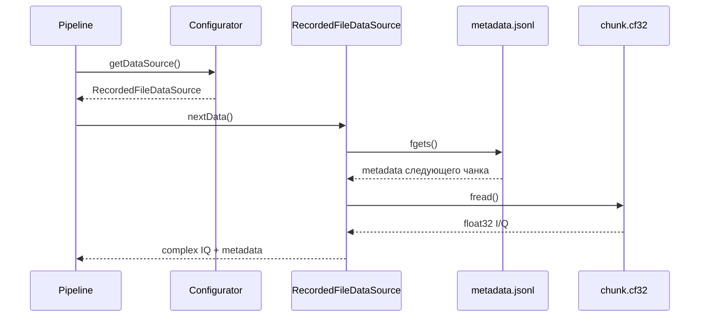
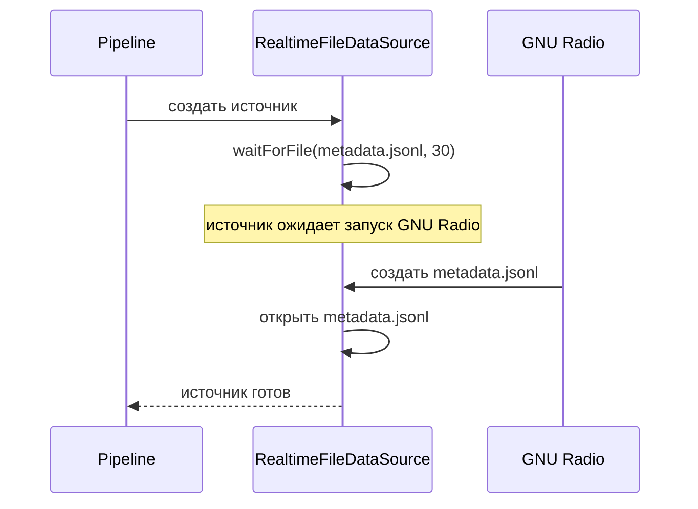
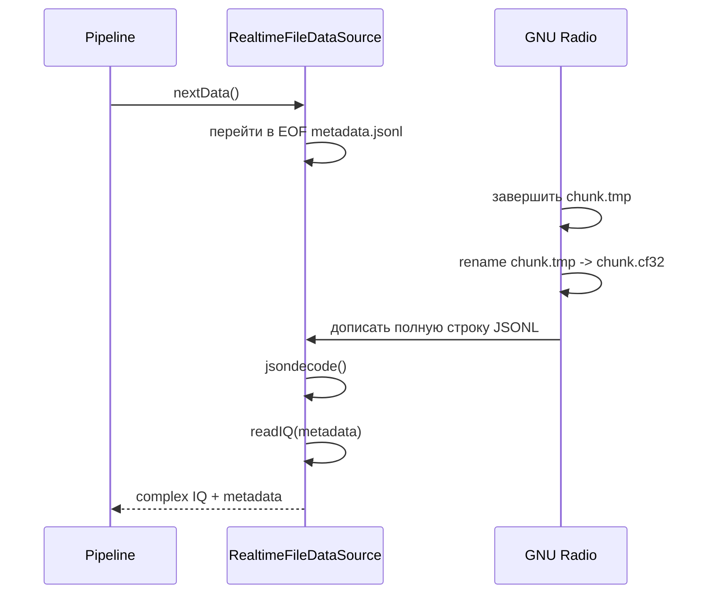
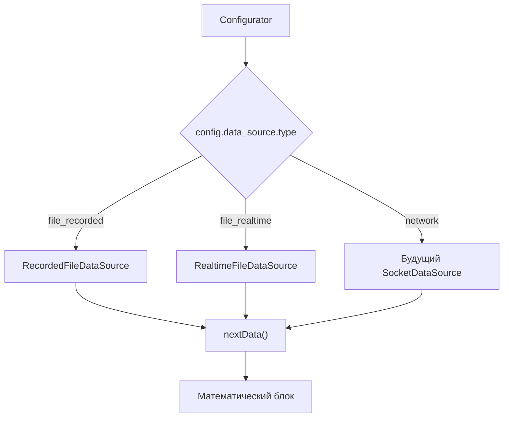

---
tags:
  - architecture
  - usage
  - examples
---

# Сценарии использования

## Зачем нужны сценарии

Архитектуру полезно проверять не только диаграммами, но и простыми историями использования.

Если сценарий можно описать коротко, а детали транспорта остаются внутри источника, границы выбраны удачно.

## Сценарий 1. Просмотр сохранённой записи



После последней строки источник возвращает EOF-состояние.

Подробнее: [[07 - RecordedFileDataSource]].

## Сценарий 2. Запуск MATLAB до GNU Radio



Подробнее: [[08 - RealtimeFileDataSource]].

## Сценарий 3. Получение свежего чанка



## Сценарий 4. Будущая замена транспорта



Математический блок не меняется.

Подробнее: [[12 - Переход к сети]].

## Минимальный внешний интерфейс

Внешнему коду достаточно:

```matlab
configurator = Configurator(config);
source = configurator.getDataSource();
[iq_complex, metadata] = source.nextData();
```

Здесь нет чтения JSONL, `fopen`, `fgets`, `fread` и `fseek`. Эти детали скрыты внутри файловой ветки.

