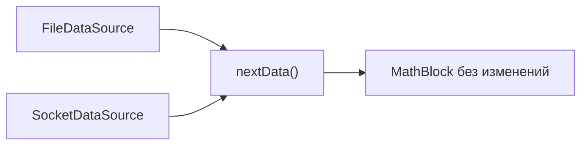

---
tags:
  - architecture
  - checklist
  - testing
---

# Проверка архитектуры

## Зачем нужен чек-лист

Архитектура становится полезной, когда её свойства можно проверить конкретными вопросами и сценариями.

## Проверка границ ответственности

### Configurator

- [ ] Только выбирает и создаёт блоки.
- [ ] Не читает JSONL.
- [ ] Не читает IQ.
- [ ] Не вычисляет FFT.
- [ ] Не рисует графику.

### FileDataSource

- [ ] Хранит общий файловый механизм.
- [ ] Открывает и закрывает `metadata.jsonl`.
- [ ] Читает IQ одинаково для файловых наследников.
- [ ] Не содержит проверок `if realtime`.
- [ ] Не знает о математике и выводе.

### RecordedFileDataSource

- [ ] Читает metadata с начала до конца.
- [ ] Не сбрасывает курсор в начало перед каждой строкой.
- [ ] Сохраняет порядок чанков.
- [ ] Обрабатывает EOF как нормальное завершение.
- [ ] Не удаляет сохранённую запись.

### RealtimeFileDataSource

- [ ] Ожидает появления `metadata.jsonl`.
- [ ] Принимает только полную JSONL-строку.
- [ ] Читает свежий чанк.
- [ ] Не удаляет неизвестные файлы.
- [ ] Имеет явную политику очистки пропущенных чанков.

## Минимальные тестовые сценарии

| Сценарий | Ожидаемый результат |
|---|---|
| Создать `FileDataSource` напрямую | MATLAB запрещает создание абстрактного класса |
| Recorded: один корректный чанк | Возвращаются IQ и metadata |
| Recorded: второй вызов после последней строки | Возвращается EOF-состояние |
| Recorded: неправильный размер `.cf32` | Понятная ошибка |
| Realtime: metadata отсутствует | Ожидание до таймаута |
| Realtime: строка JSONL дописана не полностью | Источник ждёт завершения |
| Configurator: неизвестный тип | Ошибка конфигурации |

## Проверка расширяемости

Задай вопрос:

> Можно ли добавить сетевой источник, не изменяя математический блок?

Ожидаемый ответ: да.

## Проверка пирамиды

Для каждого блока спроси:

1. Можно ли описать его задачу одним предложением?
2. Может ли он получить входы явно?
3. Можно ли изменить его внутренности без изменений в соседях?
4. Не принимает ли он решения, принадлежащие верхнему уровню?
5. Не знает ли он детали нижних блоков, которые ему не нужны?

## Связанные заметки

- [[02 - Пирамидальная декомпозиция]]
- [[13 - Следующие шаги]]
- [[18 - Сценарии использования]]

