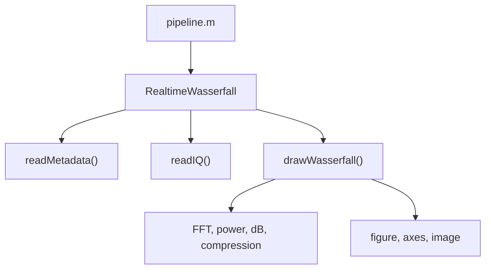
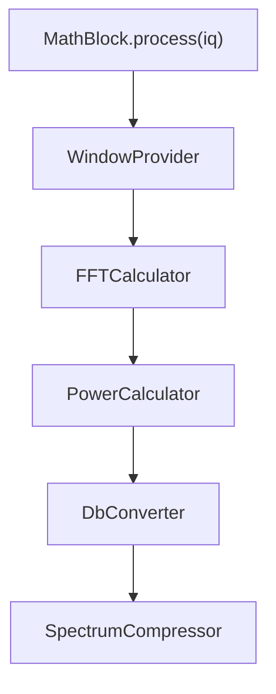
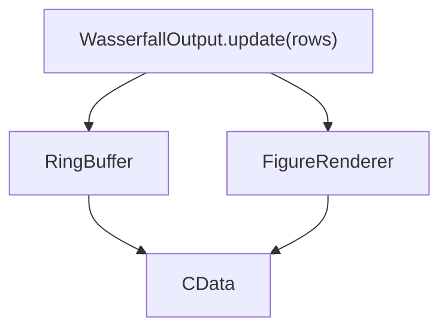

---
tags:
  - architecture
  - pipeline
  - refactoring
---

# Старый и новый pipeline

## Исходный старый pipeline

До начала рефакторинга файл `pipeline.m` использовал `RealtimeWasserfall` как центральный объект:



Проблема: один объект знает почти обо всей программе.

## Текущий промежуточный pipeline

Сейчас [[27 - Source - pipeline|pipeline.m]] уже создаёт источник через `Configurator`:


Это промежуточный этап. Получение данных уже отделено и работает независимо. Далее нужно подключить математический блок и блок вывода.

## Целевой pipeline


## Предполагаемое разбиение MathBlock



Не обязательно сразу создавать отдельный класс под каждый прямоугольник. Сначала можно использовать маленькие функции или private-методы.

## Предполагаемое разбиение блока вывода



## Правильное направление зависимостей

```text
верхний уровень выбирает и координирует
нижние уровни выполняют маленькие задачи
данные движутся явно между блоками
```

Математика не должна импортировать файловые детали. Вывод не должен открывать IQ-файлы. Источник не должен рисовать.

## Связанные заметки

- [[01 - Архитектурная цель]]
- [[02 - Пирамидальная декомпозиция]]
- [[03 - Текущая архитектура источников данных]]
- [[12 - Переход к сети]]
- [[13 - Следующие шаги]]
