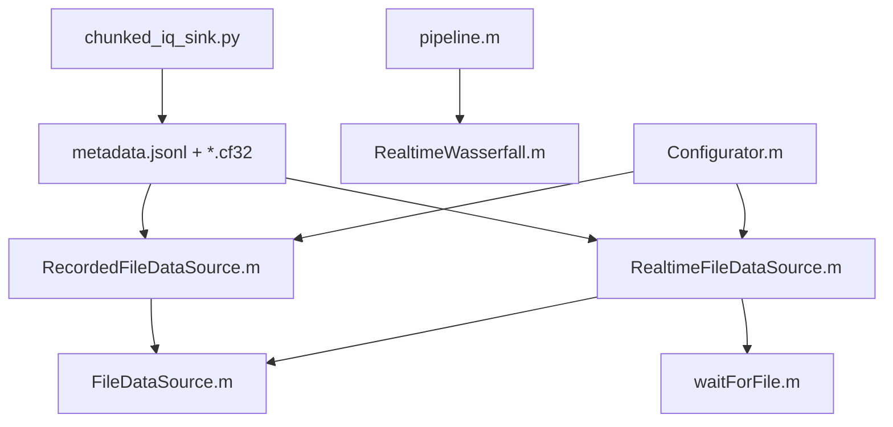

---
tags:
  - source
  - index
  - architecture
---

# Исходники проекта

## Зачем нужны source-страницы

Obsidian работает внутри vault и не разрешает обычным относительным ссылкам выходить за его пределы.

Поэтому архитектурные заметки ведут не напрямую за пределы vault, а на внутренние source-страницы. Каждая такая страница содержит:

- кликабельную локальную ссылку на реальный файл;
- путь внутри проекта;
- роль файла;
- ключевой фрагмент кода;
- связанные архитектурные заметки.

## Карта исходников

## MATLAB: новая файловая ветка

- [[22 - Source - Configurator|Configurator.m]]
- [[23 - Source - FileDataSource|FileDataSource.m]]
- [[24 - Source - RecordedFileDataSource|RecordedFileDataSource.m]]
- [[25 - Source - RealtimeFileDataSource|RealtimeFileDataSource.m]]
- [[26 - Source - waitForFile|waitForFile.m]]

## MATLAB: старый pipeline

- [[27 - Source - pipeline|pipeline.m]]
- [[28 - Source - RealtimeWasserfall|RealtimeWasserfall.m]]

## GNU Radio

- [[29 - Source - chunked_iq_sink|chunked_iq_sink.py]]

## Связанные заметки

- [[00 - Карта архитектуры]]
- [[03 - Текущая архитектура источников данных]]
- [[16 - История рефакторинга]]
