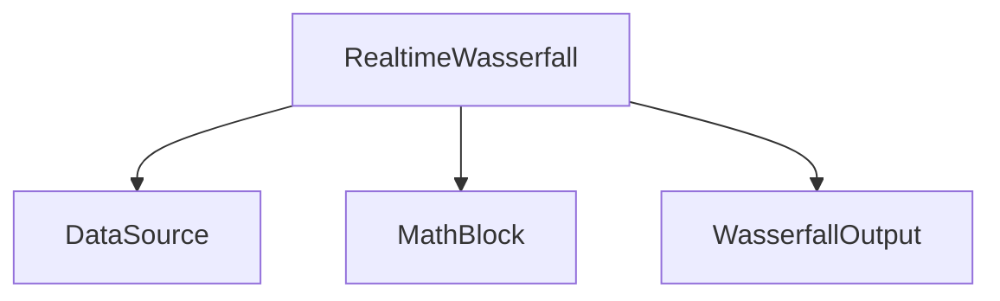

---
tags:
  - source
  - matlab
  - legacy
  - waterfall
---

# Source: RealtimeWasserfall.m

[Открыть локальный файл](file:///Users/mihailkoseev/Desktop/Projects/hackrf-matlab-spectrum/matlab/@RealtimeWasserfall/RealtimeWasserfall.m)

Путь в проекте:

```text
matlab/@RealtimeWasserfall/RealtimeWasserfall.m
```

## Роль

Центральный объект старой версии. Сейчас он хранит слишком много обязанностей:

- файловые пути;
- `metadata_fid`;
- metadata;
- IQ;
- окно FFT;
- данные водопада;
- графические handles.

## Почему класс постепенно разделяется



Новые файловые источники являются первым шагом этого разделения.

## Связанные заметки

- [[01 - Архитектурная цель]]
- [[16 - История рефакторинга]]
- [[20 - Старый и новый pipeline]]
- [[21 - Исходники проекта]]

