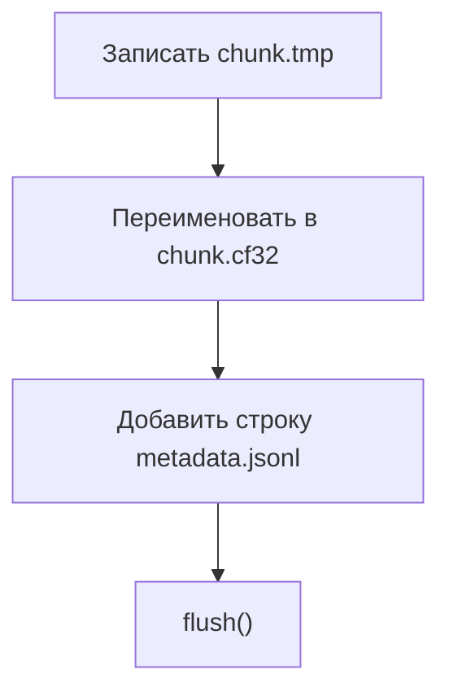

---
tags:
  - source
  - python
  - gnuradio
---

# Source: chunked_iq_sink.py

[Открыть локальный файл](file:///Users/mihailkoseev/Desktop/Projects/hackrf-matlab-spectrum/gnuradio/chunked_iq_sink/chunked_iq_sink.py)

Путь в проекте:

```text
gnuradio/chunked_iq_sink/chunked_iq_sink.py
```

## Роль

GNU Radio-блок формирует IQ-чанки и публикует metadata.

## Порядок публикации



Порядок важен для анализа гонки при массовом удалении `.cf32`.

## Связанные заметки

- [[10 - Жизненный цикл файлов]]
- [[08 - RealtimeFileDataSource]]
- [[11 - Формат IQ-данных]]
- [[21 - Исходники проекта]]

